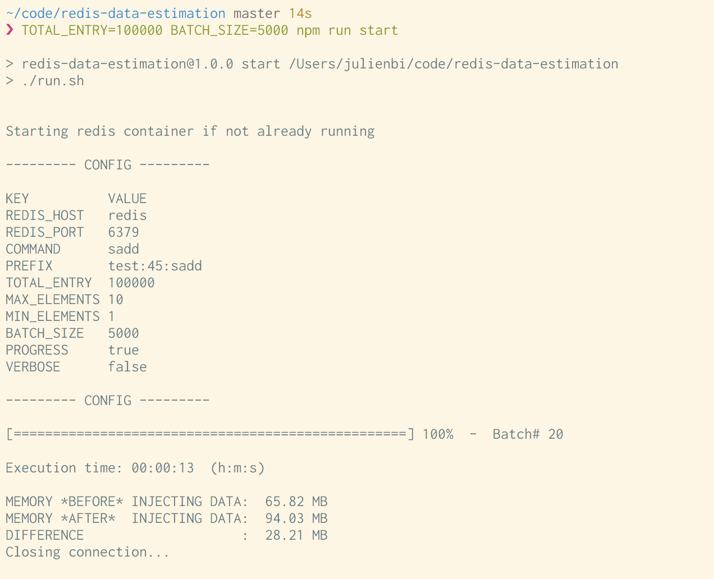

# redis-data-estimation

How much data will Redis use ?

In order to make a better guess,
this tools will generate the data and print out the size used in Redis to the terminal.

## Questions

* What will be the volume in terms of requests per second
* data amounts to store
* will this be cache only
* is there a requirements for persistence
* how small can this cluster be in staging compared to prd

## Requirements

* `docker`

or if running locally:

* `node` LTS (version: 8+)
* `redis`

## Environmental Variables

| ENV           |  DESCRIPTION | DEFAULT |
|---------------|--------------|---------|
| PREFIX        | Prefix for redis keys   | `test:${random(0, 100)}:${COMMAND}` |
| COMMAND       | Redis command to add data    | `sadd` |
| TOTAL_ENTRY   | Total number of keys | `100` |
| MAX_ELEMENTS  | Maximum number of elements/key (if applicable) | `10` |
| MIN_ELEMENTS  | Minimum number of elements/key (if applicable)  | `1` |
| BATCH_SIZE    | Number of keys to batch insert at once | `100` |
| PROGRESS      | Display a progress bar | `true` |
| VERBOSE       | Print out the first key of each batch | `false` |
| REDIS_HOST    | Redis host to connect to | `redis` |
| REDIS_PORT    | Redis port to connect to | `6379` |

## How to use it

The app will generate random data using `lodash/random` for values and `crypto.randomBytes` from
the `crypto` node modules to generate uuid for keys. An array of commands are batched together and
executed at once. To define the size of the batch use the environmental variable `BATCH_SIZE`.
Note that the size of the batch should be smaller than the total number of entry generated.
( `TOTAL_ENTRY` >= `BATCH_SIZE`)

Redis uses different data structure such as `set`, `hash`, `list`, ... .
For each data structure, there is a command that can add data to it
such `SADD` for a `set`, `HMSET` for a `hash` and so on.
To use a specific data structure, define the command by the environmental variable `COMMAND`

Some commands have more than one parameter.
To define the number of parameters,
use the environmental variable `MIN_ELEMENTS` and `MAX_ELEMENTS`.

The size of the data in Redis is obtained by using `redis-cli`:

```bash
redis-cli info memory
```

Here is an example of the execution:



## Run Benchmark in a container

This will spin up 2 containers: `redis` and `node index.js` (the app).
Simply use `npm run start` or directly the bash script `./run.sh`

```bash
COMMAND=sadd  TOTAL_ENTRY=100000 BATCH_SIZE=5000 npm run start
```

## Run Benchmark locally

Just use `npm run start:local`

```bash
COMMAND=lpush TOTAL_ENTRY=100000 BATCH_SIZE=5000 npm run start:local
```
